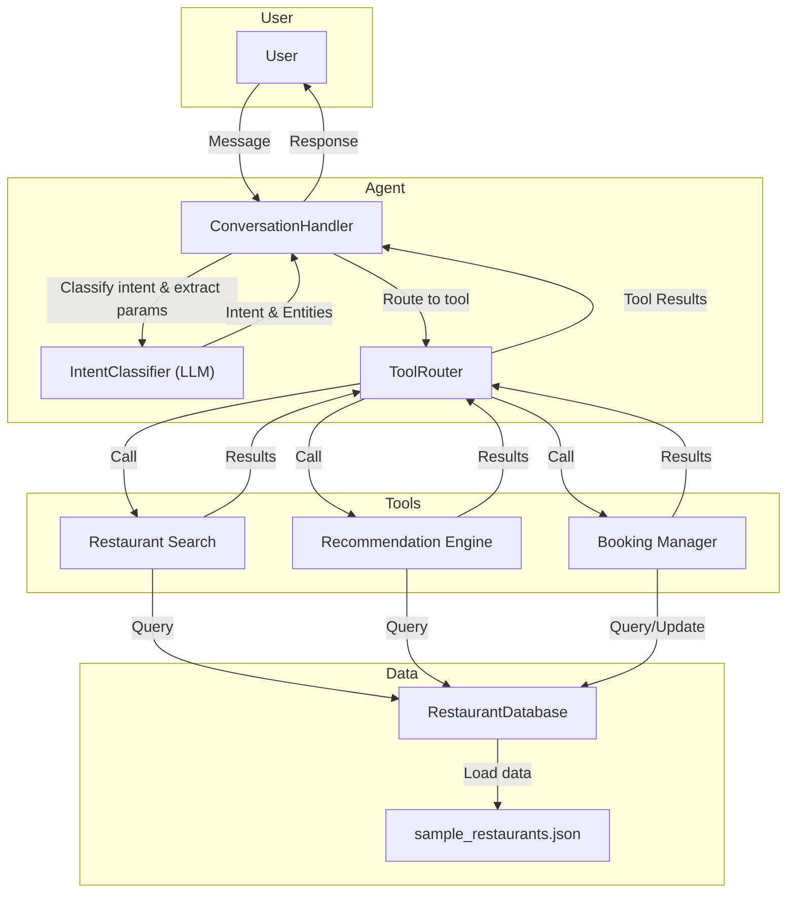

# Technical Architecture

This document describes the technical architecture of the Restaurant AI Agent system.

---

## High-Level Overview

The Restaurant AI Agent is a modular conversational system that enables users to search for restaurants, get recommendations, and make or manage reservations via natural language. The system leverages LLMs for intent classification and response generation, and is designed for extensibility and integration with external data sources.

---

## Main Components

- **User Interface**: (Not included in this repo) Sends user messages to the backend agent.
- **ConversationHandler** (`src/agent/conversation_handler.py`): Orchestrates the conversation, manages history, and coordinates intent classification, tool routing, and response generation.
- **IntentClassifier** (`src/agent/intent_classifier.py`): Uses an LLM to classify user intent (e.g., search, book, recommend) and extract relevant entities (date, time, cuisine, etc.).
- **ToolRouter** (`src/agent/tool_router.py`): Maps classified intents to the appropriate tool (search, recommend, book) and passes parameters.
- **Tools** (`src/tools/`):
  - **Restaurant Search**: Finds restaurants matching user criteria.
  - **Recommendation Engine**: Suggests restaurants based on preferences.
  - **Booking Manager**: Handles reservations, modifications, and cancellations.
- **RestaurantDatabase** (`src/data/restaurant_data.py`): Loads and queries restaurant data from `sample_restaurants.json`.
- **LLM Client** (`src/utils/llm_client.py`): Handles all LLM-based tasks (intent classification, parameter extraction, response generation).

---

## Data Flow Diagram

---

## Component Responsibilities

- **ConversationHandler**: Receives user messages, manages conversation state, invokes intent classification, routes to tools, and generates responses.
- **IntentClassifier**: Uses LLM to determine user intent and extract structured entities from free-form text.
- **ToolRouter**: Maps intents to the correct tool and passes extracted parameters.
- **Tools**:
  - **Restaurant Search**: Filters restaurants by cuisine, location, party size, etc.
  - **Recommendation Engine**: Provides personalized suggestions.
  - **Booking Manager**: Books, modifies, or cancels reservations.
- **RestaurantDatabase**: Provides access to restaurant data and supports search/filter operations.
- **LLM Client**: Abstracts LLM API calls for intent classification and response generation.

---

## Technologies Used

- **Python 3**
- **Google Gemini LLM API** (via `google.generativeai`)
- **Dataclasses** for data modeling
- **JSON** for data storage and communication

---

## Extensibility

- New tools (e.g., loyalty, feedback) can be added by extending the ToolRouter and implementing new modules in `src/tools/`.
- The system is designed to integrate with external booking systems, CRM, and analytics platforms in future iterations.

---

## Notes
- The current system uses a static sample restaurant dataset for demonstration.
- All LLM-based tasks are abstracted for easy replacement or upgrade.
- The architecture supports both synchronous and asynchronous tool calls.
