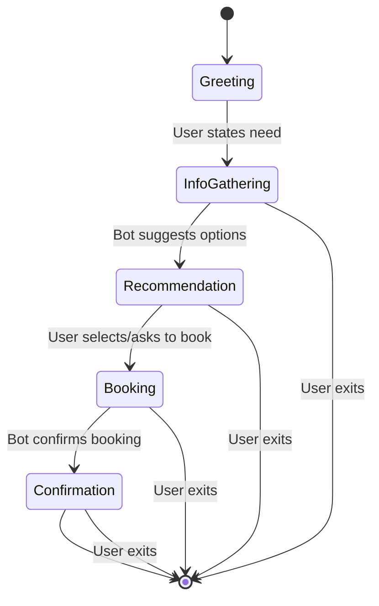

# GoodFoods Reservation AI Agent: Comprehensive Use Case Document

## Goal
To automate and enhance the restaurant reservation experience for GoodFoods customers, providing seamless search, recommendation, and booking via a conversational AI agent.

## Long Term Goal
To become the go-to digital concierge for all dining needs, integrating with loyalty, feedback, and marketing systems, and expanding to other hospitality domains.

## Success Criteria
- 20% increase in reservations within 6 months
- >8.5 NPS from users
- <15% no-show rate
- High engagement and repeat usage

## What will make this bot successful
- Fast, accurate, and friendly responses
- Personalized recommendations
- Reliable booking and confirmation
- Easy integration with existing systems

## Use Case (100 words)
GoodFoods customers want a quick, reliable way to find and book tables across multiple locations. The AI agent allows users to search by cuisine, location, or group size, get personalized recommendations, and book instantly—all via natural conversation. The bot handles ambiguous requests, suggests alternatives, and confirms bookings, reducing staff workload and improving customer satisfaction. Over time, it learns preferences and integrates with loyalty programs, making every interaction smarter and more valuable for both the customer and the business.

## Key Steps (Bot Flow)
1. User greets or states their dining need
2. Bot asks clarifying questions if needed (date, time, cuisine, location, group size)
3. Bot searches and/or recommends restaurants
4. User selects or confirms a restaurant
5. Bot books the table and confirms details
6. Bot offers to help with anything else

## State Transition Diagram

## Bot Features
- Natural language chat interface
- Restaurant search (by cuisine, location, group size)
- Personalized recommendations
- Instant booking and confirmation
- Handles ambiguous/partial requests
- Error handling and fallback suggestions
- Extensible for loyalty, feedback, and marketing

## KBs
- Restaurant data (locations, cuisines, capacity)
- Booking history (optional, for personalization)

## Does it need Tools?
- Yes: Search, Recommendation, Booking

## Which Languages
- English (MVP)
- Multilingual support (future)

## Any new features asked for?
- Loyalty integration (Yellow)
- Feedback collection (Yellow)
- Real-time availability (Red)

## Color Green, Yellow, Red basis difficulty
- Green: Search, Recommend, Book, Chat UI
- Yellow: Loyalty, Feedback, Analytics
- Red: Real-time sync, Multilingual, Deep personalization

## What integrations are needed
- Restaurant POS/booking system (Yellow)
- CRM/loyalty platform (Yellow)
- Email/SMS for confirmations (Green)

## Scale up / Rollout Strategy
- Pilot in 2-3 locations with real users
- Collect feedback, iterate on UX and features
- Gradual rollout to all locations
- Add integrations and advanced features post-MVP

## What would be a reasonable way to test and roll this out?
- Internal testing with staff
- Beta with select customers
- Monitor key metrics (NPS, bookings, errors)
- A/B test new features

## Key Challenges
- Handling ambiguous or incomplete user requests
- Integrating with legacy booking/POS systems
- Ensuring data privacy and security
- Scaling to high user volumes
- Maintaining high LLM accuracy and low latency 